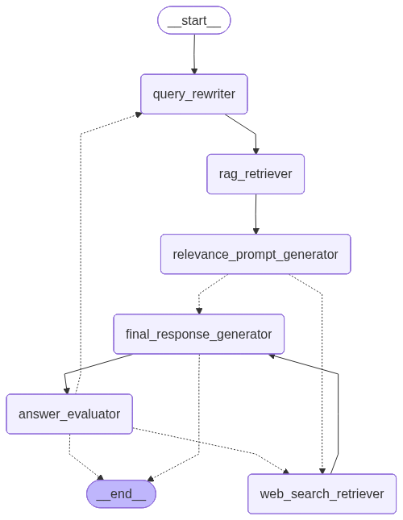

# Gloomhaven AI Agent

An AI agent that answers questions about Gloomhaven board game rules. Ask a question about how to play, and it searches the rulebook to find the answer.

## What it does

- Takes a question about Gloomhaven rules
- Searches the rulebook for relevant information
- If needed, searches the web for extra help
- Gives you an answer with explanation

## How to use:

Run neccessary cells in jupyter notebook. You can run both locally and in colab.

## Example Questions

- "Can I attack an adjacent enemy with a ranged attack?"
- "How do I set up a scenario?"
- "What happens when I draw a null card?"

## How it Works



The agent tries up to 3 times to get a good answer:
1. First try: searches the rulebook
2. Second try: rewrites the query and searches again
3. Third try: falls back to web search
(Might fallback to web search after first try as well)

## Configuration

Edit `config.yaml` to change:
- LLM model and temperature
- Number of rulebook chunks to retrieve
- Maximum retry attempts

## Evaluation:
1. Generate 15 question-answer pairs based on 3 examples
2. Input questions into agenti ai
3. Check manually and also use llm as judge 
4. Evaluate results

## Project Structure

```
├── config.yaml          # Configuration
├── agent/
│   ├── agent.py        # Main agent class
│   ├── edges.py        # Routing logic
│   ├── graph.py        # LangGraph setup
│   ├── llm_factory.py  # LLM creation
│   ├── nodes.py        # Agent steps
│   ├── prompts.py      # Prompt templates
│   ├── state.py       # State definitions
│   └── utils.py       # Utility functions
├── services/
│   └── rag_service.py  # Rulebook search
├── tests/
│   ├── dataset_generator.py  # Test data generation
│   ├── evaluate_agent.py     # Evaluation
│   └── test_agent.py         # Unit tests
└── notebook.ipynb            # Run evaluation and chat here
```

## API Keys Needed

- **GROQ_API_KEY**: Get from [groq.com](https://groq.com)
- **TAVILY_API_KEY**: Get from [tavily.com](https://tavily.com)

The agent uses Groq for LLM calls and Tavily for web search.
